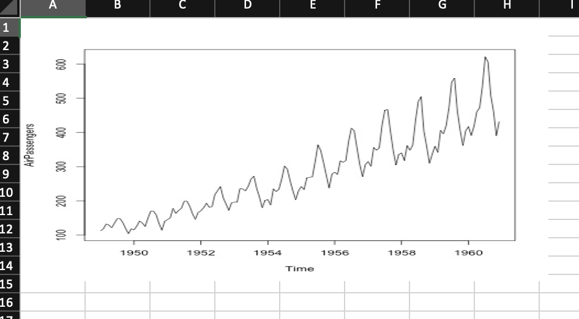
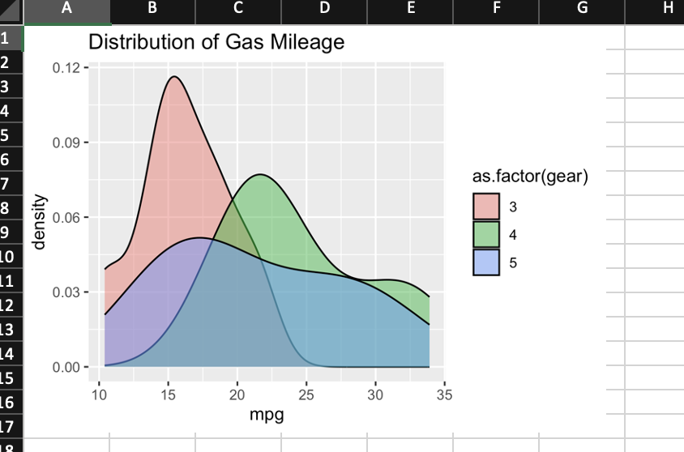
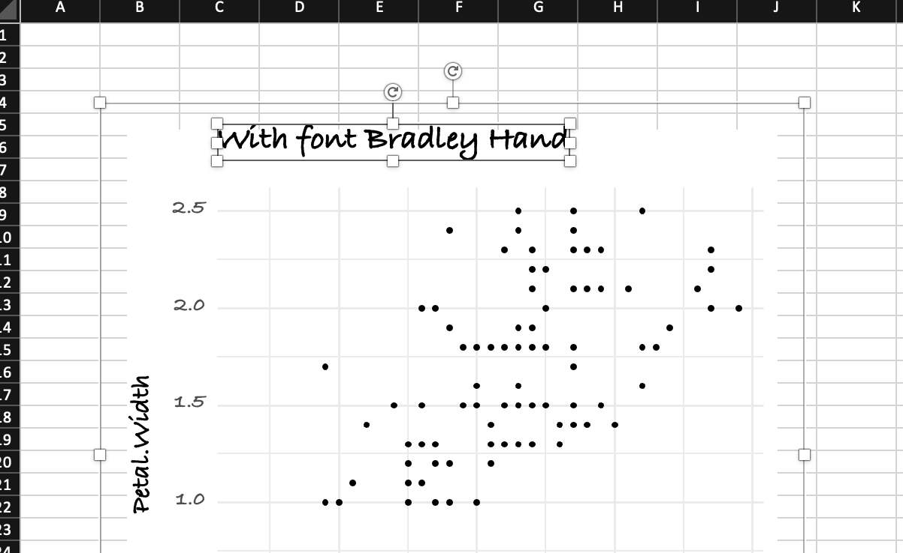
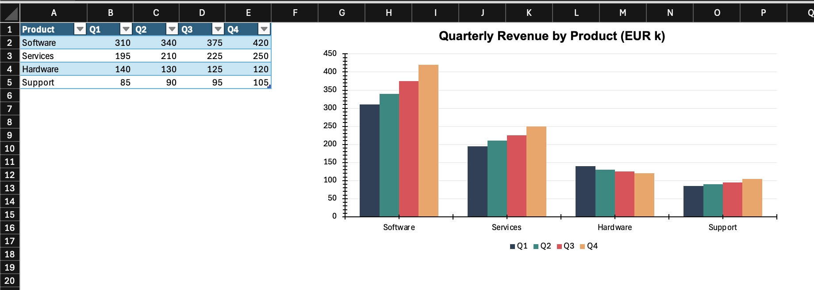
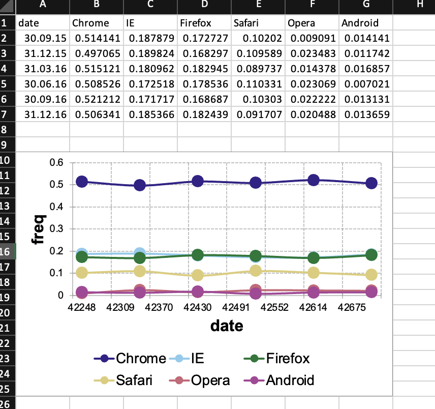

```{r setup, include = FALSE}
library(openxlsx2)
options(rmarkdown.html_vignette.check_title = FALSE)
knitr::opts_chunk$set(
  collapse = TRUE,
  comment = "#>"
)
```

The following manual will present various ways to add plots and charts to `openxlsx2` worksheets and even chartsheets. This assumes that you have basic knowledge how to handle `openxlsx2` and are familiar with either the default `R` `graphics` functions like `plot()` or `barplot()` and `grDevices`, or with the packages [`{ggplot2}`](https://ggplot2-book.org/), [`{rvg}`](https://davidgohel.github.io/rvg/), or [`{encharter}`](https://janmarvin.github.io/encharter/) and [`{mschart}`](https://ardata-fr.github.io/officeverse/charts-with-mschart.html). There are plenty of other manuals that cover using these packages better than we could ever tell you to.

```{r package}
library(openxlsx2)

## create a workbook
wb <- wb_workbook()
```

## Adding a chart as an image to a workbook

You can include any image in PNG or JPEG format. Simply open a device and save the output and pass it to the worksheet with `wb_add_image()`.

```{r plot}
myplot <- tempfile(fileext = ".jpg")
jpeg(myplot)
plot(AirPassengers)
invisible(dev.off())

# Add basic plots to the workbook
wb$add_worksheet("add_image")$add_image(file = myplot)
```

```{r echo=FALSE, warning=FALSE}
#| fig-cap: "The plot output added as image"

```

It is possible to use [`{ragg}`](https://ragg.r-lib.org/) to create the png files to add to the worksheet:

```{r}
library(ragg)
ragg_file <- tempfile(fileext = ".png")
agg_png(ragg_file, width = 1000, height = 500, res = 144)
plot(x = mtcars$mpg, y = mtcars$disp)
invisible(dev.off())

wb$add_worksheet("add_image2")$add_image(file = ragg_file)
```

## Adding `{ggplot2}` plots to a workbook

You can include `{ggplot2}` plots similar to how you would include them with `openxlsx`. Call the plot first and afterwards use `wb_add_plot()`.

```{r ggplot}
#| output: false
library(ggplot2)

ggplot(mtcars, aes(x = mpg, fill = as.factor(gear))) +
  ggtitle("Distribution of Gas Mileage") +
  geom_density(alpha = 0.5)

# Add ggplot to the workbook
wb$add_worksheet("add_plot")$
  add_plot(width = 5, height = 3.5, fileType = "png", units = "in")
```

```{r echo=FALSE, warning=FALSE}
#| fig-cap: "The ggplot2 output"

```

## Adding plots via `{rvg}` or `{devEMF}`

If you want vector graphics that can be modified in spreadsheet software the `dml_xlsx()` device comes in handy. You can pass the output via `wb_add_drawing()`.

```{r rvg}
library(rvg)

## create rvg example
tmp <- tempfile(fileext = ".xml")
dml_xlsx(file =  tmp, fonts = list(sans = "Bradley Hand"))
ggplot(data = iris,
       mapping = aes(x = Sepal.Length, y = Petal.Width)) +
  geom_point() + labs(title = "With font Bradley Hand") +
  theme_minimal(base_family = "sans", base_size = 18)
invisible(dev.off())

# Add rvg to the workbook
wb$add_worksheet("add_drawing")$
  add_drawing(xml = tmp)$
  add_drawing(xml = tmp, dims = NULL)
```

```{r echo=FALSE, warning=FALSE}
#nolint start
#| fig-cap: "An rvg chart is a vector graphic that can be modified in spreadsheet software (this screenshot differs from the code above as the second chart below has been removed)"

#nolint end
```

```{r}
library(devEMF)

tmp_emf <- tempfile(fileext = ".emf")
devEMF::emf(file = tmp_emf)
ggplot(data = iris,
       mapping = aes(x = Sepal.Length, y = Petal.Width)) +
  geom_point()
dev.off()

# Add rvg to the workbook
wb$add_worksheet("add_emf")$
  add_drawing(dims = "A1:D4", xml = tmp)$
  add_image(dims = "E1:H4", file = tmp_emf)
```

## Adding `{encharter}` plots

```{r}
library(encharter)

df_bar <- data.frame(
  Product = c("Software", "Services", "Hardware", "Support"),
  Q1      = c(310, 195, 140, 85),
  Q2      = c(340, 210, 130, 90),
  Q3      = c(375, 225, 125, 95),
  Q4      = c(420, 250, 120, 105)
)

wb <- wb_add_worksheet(wb, "add_encharter", grid_lines = FALSE)
wb <- wb_add_data_table(
  wb, sheet = "add_encharter", x = df_bar,
  dims = "A1", table_style = "TableStyleMedium2"
)
wb <- wb_set_col_widths(wb, sheet = "add_encharter", cols = 1:5, widths = c(12, 8, 8, 8, 8))
wb_df <- wb_data(wb)

chart <- ec("barChart")
chart$set_chart_title("Quarterly Revenue by Product (EUR k)", bold = TRUE)
chart$set_y_axis(min = 0, format = "#,##0", grid_lines = TRUE, grid_color = "EEEEEE")

colors    <- c("2E4057", "048A81", "E84855", "F4A261")
quarters  <- c("Q1", "Q2", "Q3", "Q4")
cols      <- c("B",  "C",  "D",  "E")
variables <- names(wb_df)
for (i in seq_along(quarters)) {
  chart$add_series(
    name   = variables[i + 1L],
    label  = variables[1L],
    data   = wb_df,
    color  = colors[i]
  )
}

chart$set_legend_style(pos = "bottom")

wb <- wb_add_encharter(wb, sheet = "add_encharter", graph = chart, dims = "G1:P18")

```

```{r echo=FALSE, warning=FALSE}
#| fig-cap: "An encharter graph"

```

A broad selection of potential chart types available to `{encharter}` [@encharter] can be found in the project homepage: "https://github.com/JanMarvin/encharter" and in its examples folder. The package was created specifically to support various chart types in `openxlsx2`. This includes combo charts, as well as several chart features such as trend lines, secondary axis and modern spreadsheet charts such as Box and Whisker charts. The package supports the `openxlsx2` functions `wb_color()` and `fmt_txt()` to tweak colors and text.

### Add and fill a chartsheet

Finally it is possible to add `encharter` objects into chartsheets. These are special sheets that contain only a chart object, referencing data from another sheet.

```{r chartsheet}
# add chartsheet
wb <- wb |>
  wb_add_chartsheet() |>
  wb_add_encharter(graph = chart)
```

## Adding `{mschart}` plots

Support for the `{mschart}` [@mschart] package provides functionality to add charts that can be used with spreadsheets. This might be useful for users of the `{officer}` package [@officer].

```{r mschart}
library(mschart)

## create chart from mschart object (this creates new input data)
mylc <- ms_linechart(
  data = browser_ts,
  x = "date",
  y = "freq",
  group = "browser"
)

wb$add_worksheet("add_mschart")$add_mschart(dims = "A10:G25", graph = mylc)
```

```{r echo=FALSE, warning=FALSE}
#| fig-cap: "An mschart graph"

```
