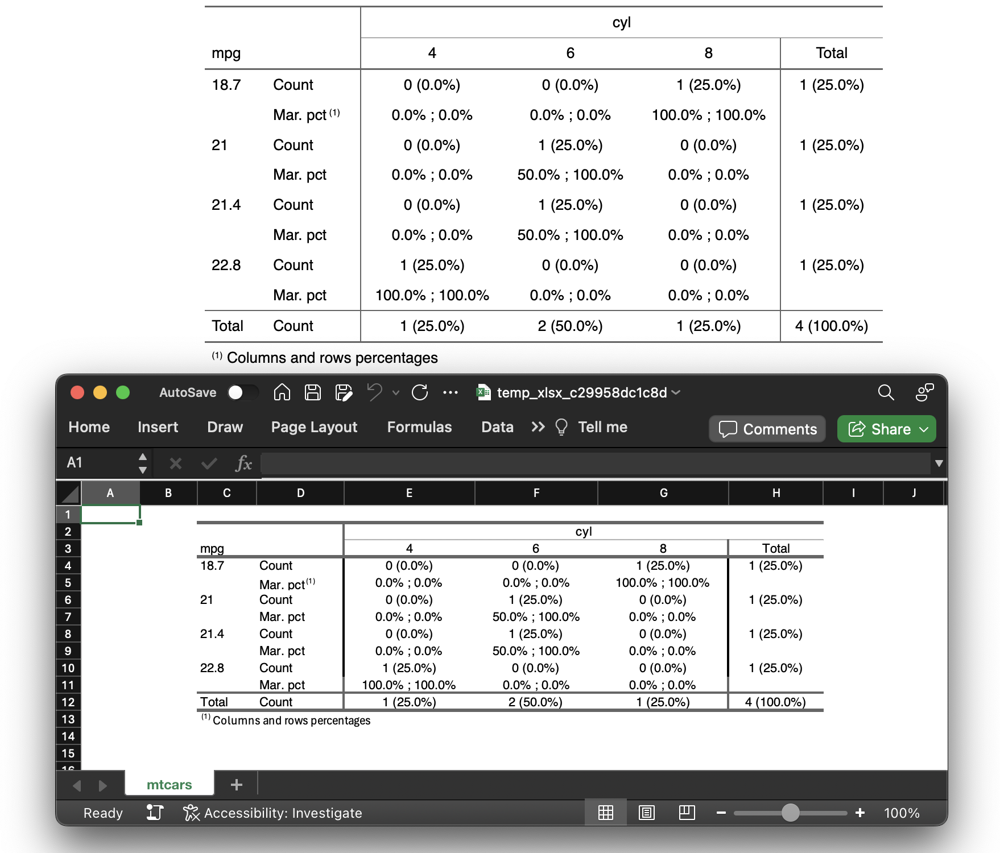

```{r, include = FALSE}
knitr::opts_chunk$set(
  collapse = TRUE,
  comment = "#>"
)
set.seed(123)
```

```{r setup}
library(openxlsx2)
```

## `msoc` - Encrypting / Decrypting workbooks

You might want to look at `msoc` [@msoc] for openxml file level encryption/decryption.

```{r}
library(msoc)

xlsx <- temp_xlsx()

# let us write some worksheet
wb_workbook()$add_worksheet()$add_data(x = mtcars)$save(xlsx)

# now we can encrypt it
encrypt(xlsx, xlsx, pass = "msoc")

# the file is encrypted, we can not read it
try(wb <- wb_load(xlsx))

# we have to decrypt it first
decrypt(xlsx, xlsx, pass = "msoc")

# now we can load it again
wb_load(xlsx)$to_df() |> head()
```

## `flexlsx` - Exporting `flextable` to workbooks

Using `flexlsx` [@flexlsx] you can extend `openxlsx2` to write `flextable` objects [@flextable] to spreadsheets. Various styling options are supported. A detailed description how to create flextables is given in the flextable book (a link is in the bibliography).

```{r}
#| output: false
library(flexlsx)

wb <- wb_workbook()$add_worksheet("mtcars", grid_lines = FALSE)

# Create a flextable and an openxlsx2 workbook
ft <- flextable::as_flextable(table(mtcars[2:5, 1:2]))
ft

# add the flextable ft to the workbook, sheet "mtcars"
# offset the table to cell 'C2'
wb <- flexlsx::wb_add_flextable(wb, "mtcars", ft, dims = "C2")

if (interactive()) wb$open()
```

```{r echo=FALSE, warning=FALSE}
#| fig-cap: "The flextable written as xlsx file and as image"

```

## `openxlsx2Extras` - Extending `openxlsx2`

Early in development, `openxlsx2Extras` [@openxlsx2Extras] allows extending various functions for user convenience or for features, that are more focused on working along `openxlsx2` and therefore are not necessary a requirement for the package itself.

One example (more can be found on the project github and pkgdown pages) is the following.

```{r}
library(openxlsx2Extras)

wb_new_workbook(
  title = "Workbook created with wb_new_workbook",
  sheet_names = c("First sheet", "Second sheet"),
  tab_color = c(wb_color("orange"), wb_color("yellow"))
)
```

## `ovbars` - Reading the `vbaProject.bin`

Another niche package is `ovbars` [@ovbars]. This package allows reading the binary blob that contains macros in `xlsm` and potentially `xlsb` files. The package allows extracting the VBA code.

```{r}
url <- "https://github.com/JanMarvin/openxlsx-data/raw/refs/heads/main"
fl <- file.path(url, "gh_issue_416.xlsm")
wb <- openxlsx2::wb_load(fl)
vba <- wb$vbaProject

code <- ovbars::ovbar_out(name = vba)
message(code["Sheet1"])
```

## `spaghetti` - Helpers for spreadsheet formulas {#sec-spaghetti}

Modern spreadsheet formulas look differently on the XML level and that is just the beginning of the many wonderful issues that come along with spreadsheet formulas. Here `spaghetti` [@spaghetti] should be a help.

```{r}
library(spaghetti)

# Some data to work with
products <- data.frame(
  id    = c(3, 1, 2, 1, 3, 2),
  name  = c("Apple", "Banana", "Cherry", "Banana", "Apple", "Cherry"),
  sales = c(120, 85, 200, 95, 110, 175)
)

wb <- wb_workbook() |>
  wb_add_worksheet("Data") |>
  wb_add_data(x = products, dims = "A1")

# UNIQUE + SORT: deduplicated sorted product list spilling from E2
wb <- wb |>
  wb_add_data(
    dims = "E1", x = "Unique Products"
  ) |>
  wb_add_formula(
    dims = "E2",
    x = spaghetti::to_xml("=UNIQUE(SORT(B2:B7))"),
    cm = TRUE
  )

# MAP: identical to =SUMIF(B2:B7, E2#, C2:C7) just showing some modern functions
# ref. to_xml() works with single formulas or vectors
wb <- wb |>
  wb_add_data(
    dims = "F1", x = "Total Sales"
  ) |>
  wb_add_formula(
    dims = "F2",
    x = spaghetti::to_xml("=MAP(E2#, LAMBDA(p, SUM((B2:B7=p)*C2:C7)))"),
    cm = TRUE
  )

if (interactive()) wb$open()
```

It also provides a linter and can handle translations.
